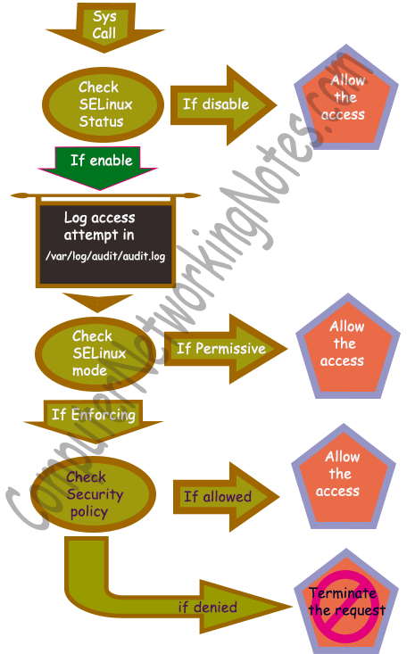

# 3

## 3.2
```
$ sudo firewall-cmd --list-all
drop (active)
  target: default
  icmp-block-inversion: no
  interfaces: enp0s3 enp0s8
  sources: 
  services: cockpit dhcpv6-client ssh
  ports: 80/tcp
  protocols: 
  forward: yes
  masquerade: no
  forward-ports: 
  source-ports: 
  icmp-blocks: 
  rich rules: 
```


```
Include /etc/ssh/sshd_config.d/*.conf

Port 7372
AddressFamily any
ListenAddress 0.0.0.0
ListenAddress ::

HostKey /etc/ssh/ssh_host_ed25519_key

RekeyLimit default none

SyslogFacility AUTH
LogLevel INFO

LoginGraceTime 2m
PermitRootLogin no
StrictModes yes
MaxAuthTries 3
MaxSessions 2

PubkeyAuthentication yes
AuthorizedKeysFile /home/%u/.ssh/authorized_keys

HostbasedAuthentication no
IgnoreUserKnownHosts no
IgnoreRhosts yes

PasswordAuthentication no
PermitEmptyPasswords no

KbdInteractiveAuthentication no

KerberosAuthentication no
KerberosOrLocalPasswd no
KerberosTicketCleanup no
KerberosGetAFSToken no

GSSAPIAuthentication no
GSSAPICleanupCredentials yes
GSSAPIStrictAcceptorCheck yes
GSSAPIKeyExchange no

UsePAM yes

AllowAgentForwarding no
AllowTcpForwarding no
GatewayPorts no
X11Forwarding no
PermitTTY yes
PrintMotd no
PrintLastLog yes
TCPKeepAlive yes
PermitUserEnvironment no
Compression delayed
ClientAliveInterval 300
ClientAliveCountMax 0
UseDNS no
PidFile /run/sshd.pid
MaxStartups 2
PermitTunnel no
ChrootDirectory none
VersionAddendum none

Banner none

AcceptEnv LANG LC_*

Subsystem sftp /usr/lib/openssh/sftp-server

Match User lucas
    AuthorizedKeysFile /home/lucas/.ssh/authorized_keys
    AllowTcpForwarding no
    X11Forwarding no
    PermitTTY yes
    AllowAgentForwarding no
```

## 3.3

### 1
```
$ sudo dnf install httpd
$ sudo systemctl enable httpd
$ sudo systemctl start httpd

$ sudo systemctl enable httpd
Created symlink /etc/systemd/system/multi-user.target.wants/httpd.service → /usr/lib/systemd/system/httpd.service.
[lucas@localhost ~]$ sudo systemctl start httpd
[lucas@localhost ~]$ sudo systemctl status httpd
● httpd.service - The Apache HTTP Server
     Loaded: loaded (/usr/lib/systemd/system/httpd.service; enabled; preset: disabled)
     Active: active (running) since Fri 2025-04-04 14:02:37 CEST; 31s ago
```


```
$ curl http://localhost

blah blah

<p class="summary">This page is used to test the proper operation of
            an HTTP server after it has been installed on a Rocky Linux system.
            If you can read this page, it means that the software is working
            correctly.</p>

blah blah
```

### 2
```
$ sestatus
SELinux status:                 disabled
```

### 3

Disabled: SELinux désactivé donc les permissions redeviennent du DAC


Enforcing: SELinux applique les regles et les policies, et refuse l'accès en cas de requete non permise.


Permissive: Les requetes non permises par les regles sont effectuées mais mis en logs afin que les admins puissent debug.



### 4

Si un profil Selinux est configuré en mode « enforce » et qu’il ne convient pas parfaitement au binaire associé, la requete est refusée.

## 3.4
### 1
```
$ ls -Z /etc/httpd
system_u:object_r:httpd_config_t:s0 conf                     system_u:object_r:etc_t:s0 modules
system_u:object_r:httpd_config_t:s0 conf.d                   system_u:object_r:etc_t:s0 run
system_u:object_r:httpd_config_t:s0 conf.modules.d           system_u:object_r:etc_t:s0 state
         system_u:object_r:etc_t:s0 logs
```
### 2
```
$ ls -Z /usr/lib/systemd/system/httpd.service
system_u:object_r:httpd_unit_file_t:s0 /usr/lib/systemd/system/httpd.service
```

### 3
Le serveur web fonctionne toujours

